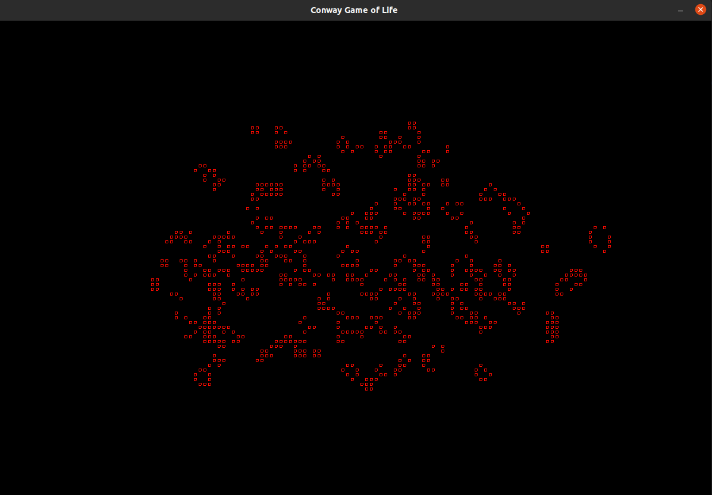

# Cellular Automata

What would the world be without cellular automation? I certainly don't know. This project is currently a first try at `SDL2 library` and creating some
automation.

## Commands

After running the program, you are in _draw_ mode. Left clicking or dragging
_turns on_ cells. Right clicking turns them back off.

Commands:

| Button         | Function                                             |
| -------------- | ---------------------------------------------------- |
| `C`            | Clears active cells (does not work when running)     |
| `G`            | Toggles the grid display                             |
| `R`            | Runs Conway's game of life. Must press again to stop |
| Keyboard Left  | Increases the speed (lowers delay)                   |
| Keyboard Right | Slows down the animation                             |

### TODO's

- [ ] ~~`Unit` class should be a static class~~
- [x] Add text and options (include SDL_ttf)
- [ ] Add Git submodules of all included libs
- [ ] Bug when exiting `CGL` mode where screen is sometimes cleared
- [ ] CLI options for x, y, spacing
- [ ] Toggling grid should have no delay
- [ ] Add other automation
- [ ] Add A\*, BFS and DFS visual search
- [x] Change how colors are displayed in `Display`
- [ ] Create some basic Game of Life patterns
  - [ ] Way to create and save/load patterns
- [ ] Include `spdlog` and remove `std::cerr`'s
